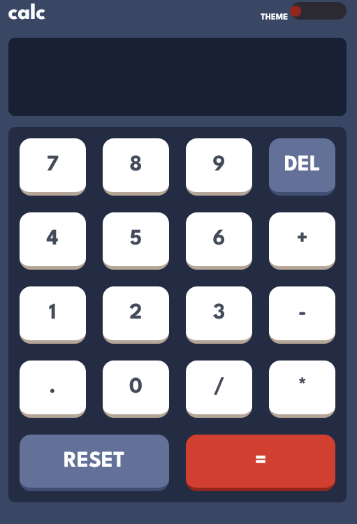
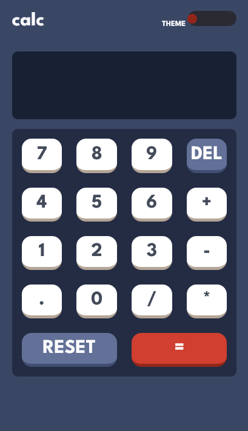
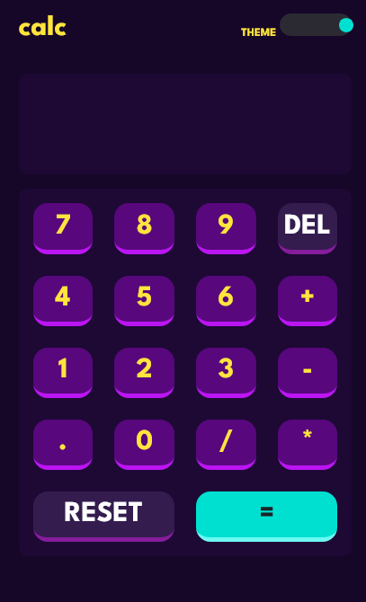

# Frontend Mentor - Calculator app solution

This is a solution to the [Calculator app challenge on Frontend Mentor](https://www.frontendmentor.io/challenges/calculator-app-9lteq5N29). Frontend Mentor challenges help you improve your coding skills by building realistic projects. 

## Table of contents

- [Overview](#overview)
  - [The challenge](#the-challenge)
  - [Screenshot](#screenshot)
  - [Links](#links)
- [My process](#my-process)
  - [Built with](#built-with)
  - [What I learned](#what-i-learned)
  - [Continued development](#continued-development)
  - [Useful resources](#useful-resources)
- [Author](#author)
- [Acknowledgments](#acknowledgments)

## Overview

### The challenge

Users should be able to:

- [x] See the size of the elements adjust based on their device's screen size
- [x] Perform mathmatical operations like addition, subtraction, multiplication, and division
- [x] Adjust the color theme based on their preference
- [x] **Bonus**: Have their initial theme preference checked using `prefers-color-scheme` and have any additional changes saved in the browser

### Screenshot

### Links

- Solution URL: [Github Folder](https://github.com/Tonilocke/JavascriptCalculatorApp)
- Live Site URL: [Github Pages](https://tonilocke.github.io/JavascriptCalculatorApp/)

## My process

### Built with

- Semantic HTML5 markup
- CSS Grid
- Mobile-first workflow

### What I learned
I have used the localStorage api and media query with javascript!

### Useful resources

- [MDN](https://developer.mozilla.org/en-US/) - A must for every web developer out there.

## Author

- Website(building...) - [tonidev](building...)
- Frontend Mentor - [@Tonilocke](https://www.frontendmentor.io/profile/Tonilocke)
- Twitter - [@toni_tonidev](https://x.com/toni_tonidev)
